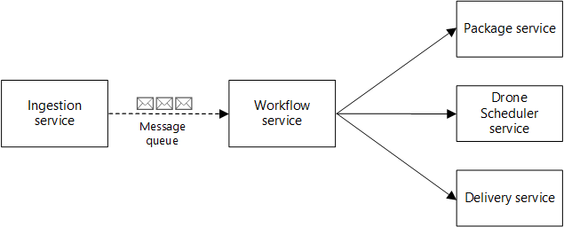

 # Deploy Workload (Fabrikam Drone Delivery Shipping app)

The cluster now has an [Azure Application Gateway Ingress Controller configured with a SSL certificate and integrated with Azure Key Vault](./08-secret-managment-and-ingress-controller.md). The last step in the process is to deploy the  Fabrikam Drone Delivery app, which will demonstrate the system's functions.

## Steps

> :book: The Fabrikam Drone Delivery app team is now ready to install the application in their new AKS cluster.  The Fabrikam Drone Delivery Shipping application is consists of several microservices. Because it's a sample, the functionality is simulated however, the APIs and microservices interactions are intended to reflect real-world design patterns.
>
>  - Ingestion service: receives client requests and buffers them.
>  - Workflow service: dispatches client requests and manages the delivery workflow.
>  - Delivery service: manages deliveries that are scheduled or in-transit.
>  - Package service: manages packages.
>  - Drone service: schedules drones and monitors drones in flight.
>
> The Fabrikam Drone Delivery app team is about to deploy all the microservices into the AKS cluster. For each of the application services, a Docker image is created, and deployment values such as Azure service names are collected. The application is then deployed using Helm.




1. Set the AKS cluster and Application Gateway subnet prefixes.

   :book: The Fabrikan Drone Delivery application follows the zero trust principle when establishing network connections between containers. Initially, any container is allowed to establish a connection with another one. The following information is required to create ALLOW Network Policies.

   ```bash
   export CLUSTER_SUBNET_PREFIX=$(az deployment group show -g rg-enterprise-networking-spokes -n spoke-shipping-dronedelivery --query properties.outputs.clusterSubnetPrefix.value -o tsv)
   export GATEWAY_SUBNET_PREFIX=$(az deployment group show -g rg-enterprise-networking-spokes -n spoke-shipping-dronedelivery --query properties.outputs.gatewaySubnetPrefix.value -o tsv)
   ```

1. Get the Azure Application Insights settings.

   ```bash
   export AI_NAME=$(az deployment group show -g rg-shipping-dronedelivery -n workload-stamp --query properties.outputs.appInsightsName.value -o tsv)
   export AI_IKEY=$(az resource show -g rg-shipping-dronedelivery -n $AI_NAME --resource-type "Microsoft.Insights/components" --query properties.InstrumentationKey -o tsv)
   ```

1. Enable temporary public access to the the ACR instance.

   :bulb: Network access to the registry is limited to specific networks. In the following steps, you will need access from your local machine to the ACR instance to upload container images to it.

   ```bash
   az acr update --name $ACR_NAME --public-network-enabled true
   az acr update --name $ACR_NAME --set networkRuleSet.defaultAction="Allow"
   ```

1. Get the OIDC Issuer URL

   ```bash
   export AKS_OIDC_ISSUER="$(az aks show -n $AKS_CLUSTER_NAME -g rg-shipping-dronedelivery --query "oidcIssuerProfile.issuerUrl" -otsv)"
   ```

1. Deploy the Delivery service application.

   Build the Delivery service.

   ```bash
   az acr build -r $ACR_NAME -t $ACR_SERVER/delivery:0.1.0 ./workload/src/shipping/delivery/.
   ```

   Extract Azure resource details for the delivery application.

   ```bash
   DELIVERY_KEYVAULT_URI=$(az deployment group show -g rg-shipping-dronedelivery -n workload-stamp --query properties.outputs.deliveryKeyVaultUri.value -o tsv)
   DELIVERY_COSMOSDB_NAME=$(az deployment group show -g rg-shipping-dronedelivery -n workload-stamp --query properties.outputs.deliveryCosmosDbName.value -o tsv)
   DELIVERY_DATABASE_NAME="${DELIVERY_COSMOSDB_NAME}-db"
   DELIVERY_COLLECTION_NAME="${DELIVERY_COSMOSDB_NAME}-col"
   DELIVERY_PRINCIPAL_RESOURCE_ID=$(az deployment group show -g rg-shipping-dronedelivery -n cluster-stamp --query properties.outputs.deliveryPrincipalResourceId.value -o tsv)
   DELIVERY_PRINCIPAL_CLIENT_ID=$(az identity show -g rg-shipping-dronedelivery -n uid-delivery --query clientId -o tsv)
   ```

   Deploy the Delivery service.

   ```bash

   #Setup your managed identity to trust your Kubernetes service account
   az identity federated-credential create --name credential-for-delivery --identity-name uid-delivery --resource-group rg-shipping-dronedelivery --issuer ${AKS_OIDC_ISSUER} --subject system:serviceaccount:backend-dev:delivery-sa-v0.1.0


   helm package ./charts/delivery/ -u
   helm install delivery-v0.1.0-dev delivery-v0.1.0.tgz \
      --set image.tag=0.1.0 \
      --set image.repository=delivery \
      --set dockerregistry=$ACR_SERVER \
      --set ingress.hosts[0].name=dronedelivery.fabrikam.com \
      --set ingress.hosts[0].serviceName=delivery \
      --set networkPolicy.egress.external.enabled=true \
      --set networkPolicy.egress.external.clusterSubnetPrefix=$CLUSTER_SUBNET_PREFIX \
      --set networkPolicy.ingress.externalSubnet.enabled=true \
      --set networkPolicy.ingress.externalSubnet.subnetPrefix=$GATEWAY_SUBNET_PREFIX \
      --set identity.clientid=$DELIVERY_PRINCIPAL_CLIENT_ID \
      --set identity.serviceAccountName=delivery-sa-v0.1.0 \
      --set cosmosdb.id=$DELIVERY_DATABASE_NAME \
      --set cosmosdb.collectionid=$DELIVERY_COLLECTION_NAME \
      --set keyvault.uri=$DELIVERY_KEYVAULT_URI \
      --set reason="Initial deployment" \
      --set envs.dev=true \
      --namespace backend-dev
   ```

   Verify the delivery service pod is running.

   ```bash
   kubectl wait --namespace backend-dev --for=condition=ready pod --selector=app.kubernetes.io/instance=delivery-v0.1.0-dev --timeout=90s
   ```
1. Deploy the Ingestion service.

   Build the Ingestion service.

   ```bash
   az acr build -r $ACR_NAME -t $ACR_SERVER/ingestion:0.1.0 ./workload/src/shipping/ingestion/.
   ```

   Extract Azure resource details for the ingestion application.

   ```bash
   export INGESTION_QUEUE_NAMESPACE=$(az deployment group show -g rg-shipping-dronedelivery -n workload-stamp --query properties.outputs.ingestionQueueNamespace.value -o tsv)
   export INGESTION_QUEUE_NAME=$(az deployment group show -g rg-shipping-dronedelivery -n workload-stamp --query properties.outputs.ingestionQueueName.value -o tsv)
   export INGESTION_ACCESS_KEY_NAME=$(az deployment group show -g rg-shipping-dronedelivery -n workload-stamp --query properties.outputs.ingestionServiceAccessKeyName.value -o tsv)
   export INGESTION_ACCESS_KEY_VALUE=$(az servicebus namespace authorization-rule keys list --resource-group rg-shipping-dronedelivery --namespace-name $INGESTION_QUEUE_NAMESPACE --name $INGESTION_ACCESS_KEY_NAME --query primaryKey -o tsv)
   ```

   Deploy the Ingestion service.

   ```bash
   helm package ./charts/ingestion/ -u
   helm install ingestion-v0.1.0-dev ingestion-v0.1.0.tgz \
         --set image.tag=0.1.0 \
         --set image.repository=ingestion \
         --set dockerregistry=$ACR_SERVER \
         --set ingress.hosts[0].name=dronedelivery.fabrikam.com \
         --set ingress.hosts[0].serviceName=ingestion \
         --set networkPolicy.egress.external.enabled=true \
         --set networkPolicy.egress.external.clusterSubnetPrefix=$CLUSTER_SUBNET_PREFIX \
         --set networkPolicy.ingress.externalSubnet.enabled=true \
         --set networkPolicy.ingress.externalSubnet.subnetPrefix=$GATEWAY_SUBNET_PREFIX \
         --set secrets.appinsights.ikey=${AI_IKEY} \
         --set secrets.queue.keyname=IngestionServiceAccessKey \
         --set secrets.queue.keyvalue=${INGESTION_ACCESS_KEY_VALUE} \
         --set secrets.queue.name=${INGESTION_QUEUE_NAME} \
         --set secrets.queue.namespace=${INGESTION_QUEUE_NAMESPACE} \
         --set reason="Initial deployment" \
         --set envs.dev=true \
         --namespace backend-dev
   ```

   Verify the pod is running.

   ```bash
   kubectl wait --namespace backend-dev --for=condition=ready pod --selector=app.kubernetes.io/instance=ingestion-v0.1.0-dev --timeout=180s
   ```

1. Deploy the Workflow service app

   Build the Workflow service.

   ```bash
   az acr build -r $ACR_NAME -t $ACR_SERVER/workflow:0.1.0 ./workload/src/shipping/workflow/.
   ```

   Extract Azure resource details for the workflow app

   ```bash
   export WORKFLOW_PRINCIPAL_CLIENT_ID=$(az identity show -g rg-shipping-dronedelivery -n uid-workflow --query clientId -o tsv)
   export WORKFLOW_KEYVAULT_NAME=$(az deployment group show -g rg-shipping-dronedelivery -n workload-stamp --query properties.outputs.workflowKeyVaultName.value -o tsv)
   ```


   Deploy the Workflow service.

   ```bash
   # Setup your managed identity to trust your Kubernetes service account
   az identity federated-credential create --name credential-for-workflow --identity-name uid-workflow --resource-group rg-shipping-dronedelivery --issuer ${AKS_OIDC_ISSUER} --subject system:serviceaccount:backend-dev:workflow-sa-v0.1.0

   helm package ./charts/workflow/ -u && \
   helm install workflow-v0.1.0-dev workflow-v0.1.0.tgz \
      --set image.tag=0.1.0 \
      --set image.repository=workflow \
      --set dockerregistry=$ACR_SERVER \
      --set identity.clientid=$WORKFLOW_PRINCIPAL_CLIENT_ID \
      --set identity.serviceAccountName=workflow-sa-v0.1.0 \
      --set identity.tenantId=$TENANT_ID \
      --set networkPolicy.egress.external.enabled=true \
      --set networkPolicy.egress.external.clusterSubnetPrefix=$CLUSTER_SUBNET_PREFIX \
      --set keyvault.name=$WORKFLOW_KEYVAULT_NAME \
      --set keyvault.resourcegroup=rg-shipping-dronedelivery \
      --set keyvault.tenantid=$TENANT_ID \
      --set reason="Initial deployment" \
      --set envs.dev=true \
      --set serviceuri.delivery="http://delivery-v010/api/Deliveries/" \
      --set serviceuri.drone="http://dronescheduler-v010/api/DroneDeliveries/" \
      --set serviceuri.package="http://package-v010/api/packages/" \
      --namespace backend-dev
   ```

   Verify the pod is running.

   ```bash
   kubectl wait --namespace backend-dev --for=condition=ready pod --selector=app.kubernetes.io/instance=workflow-v0.1.0-dev --timeout=90s
   ```

1. Deploy the DroneScheduler service application.

   Build the DroneScheduler service.

   ```bash
   az acr build -r $ACR_NAME -f ./workload/src/shipping/dronescheduler/Dockerfile -t $ACR_SERVER/dronescheduler:0.1.0 ./workload/src/shipping/.
   ```

   Extract Azure resource details for the dronescheduler app

   ```bash
   export DRONESCHEDULER_KEYVAULT_URI=$(az deployment group show -g rg-shipping-dronedelivery -n workload-stamp --query properties.outputs.droneSchedulerKeyVaultUri.value -o tsv)
   export DRONESCHEDULER_COSMOSDB_NAME=$(az deployment group show -g rg-shipping-dronedelivery -n workload-stamp --query properties.outputs.droneSchedulerCosmosDbName.value -o tsv)
   export DRONESCHEDULER_DATABASE_NAME="invoicing"
   export DRONESCHEDULER_COLLECTION_NAME="utilization"
   export DRONESCHEDULER_PRINCIPAL_CLIENT_ID=$(az identity show -g rg-shipping-dronedelivery -n uid-dronescheduler --query clientId -o tsv)
   ```

   Deploy the DroneScheduler service.

   ```bash
   # Setup your managed identity to trust your Kubernetes service account
   az identity federated-credential create --name credential-for-dronescheduler --identity-name uid-dronescheduler --resource-group rg-shipping-dronedelivery --issuer ${AKS_OIDC_ISSUER} --subject system:serviceaccount:backend-dev:dronescheduler-sa-v0.1.0

   helm package ./charts/dronescheduler/ -u && \
   helm install dronescheduler-v0.1.0-dev dronescheduler-v0.1.0.tgz \
        --set image.tag=0.1.0 \
        --set image.repository=dronescheduler \
        --set dockerregistry=$ACR_SERVER \
        --set identity.clientid=$DRONESCHEDULER_PRINCIPAL_CLIENT_ID \
        --set identity.serviceAccountName=dronescheduler-sa-v0.1.0 \
        --set networkPolicy.egress.external.enabled=true \
        --set networkPolicy.egress.external.clusterSubnetPrefix=$CLUSTER_SUBNET_PREFIX \
        --set keyvault.uri=$DRONESCHEDULER_KEYVAULT_URI \
        --set cosmosdb.id=$DRONESCHEDULER_DATABASE_NAME \
        --set cosmosdb.collectionid=$DRONESCHEDULER_COLLECTION_NAME \
        --set reason="Initial deployment" \
        --set envs.dev=true \
        --namespace backend-dev
   ```

   Verify the pod is running.

   ```bash
   kubectl wait --namespace backend-dev --for=condition=ready pod --selector=app.kubernetes.io/instance=dronescheduler-v0.1.0-dev --timeout=90s
   ```

1. Deploy the Package service app

   Build the Package service

   ```bash
   az acr build -r $ACR_NAME -t $ACR_SERVER/package:0.1.0 ./workload/src/shipping/package/.
   ```

   Extract Azure resource details for the package app

   ```bash
   export PACKAGE_DATABASE_NAME=$(az deployment group show -g rg-shipping-dronedelivery -n workload-stamp --query properties.outputs.packageMongoDbName.value -o tsv)
   export PACKAGE_CONNECTION=$(az cosmosdb keys list --type connection-strings --name $PACKAGE_DATABASE_NAME --resource-group rg-shipping-dronedelivery --query "connectionStrings[0].connectionString" -o tsv | sed 's/==/%3D%3D/g') && \
   export PACKAGE_COLLECTION_NAME=packages
   ```

   Deploy the Package service

   ```bash
   helm package ./charts/package/ -u && \
   helm install package-v0.1.0-dev package-v0.1.0.tgz \
        --set image.tag=0.1.0 \
        --set image.repository=package \
        --set networkPolicy.egress.external.enabled=true \
        --set networkPolicy.egress.external.clusterSubnetPrefix=$CLUSTER_SUBNET_PREFIX \
        --set secrets.appinsights.ikey=$AI_IKEY \
        --set secrets.mongo.pwd=$PACKAGE_CONNECTION \
        --set cosmosDb.collectionName=$PACKAGE_COLLECTION_NAME \
        --set dockerregistry=$ACR_SERVER \
        --set reason="Initial deployment" \
        --set envs.dev=true \
        --namespace backend-dev
   ```

   Verify the pod is running.

   ```bash
   kubectl wait --namespace backend-dev --for=condition=ready pod --selector=app.kubernetes.io/instance=package-v0.1.0-dev --timeout=90s
   ```

1. Remove public access to the Azure Container Registry instance.

   ```bash
   az acr update --name $ACR_NAME --set networkRuleSet.defaultAction="Deny"
   az acr update --name $ACR_NAME --public-network-enabled false
   ```

:book: The app team just finished installing the Fabrikam Drone Delivery Shipping app, and it is now operative and ready for their clients to start sending HTTP requests.

### Next step

:arrow_forward: [End-to-End Validation](./10-validation.md)