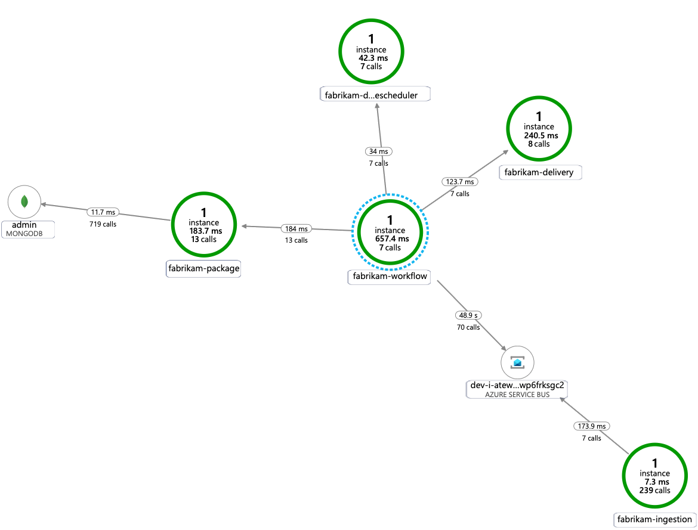

# End-to-End Validation

Now that you have a workload deployed, the [Fabrikam Drone Delivery Shipping app](./09-workload.md), you can start validating and exploring this reference implementation of the [AKS Fabrikam Drone Delivery](./). In addition to the workload, there are some observability validation you can perform as well.

## Validate the application is running

This section will help you to validate the workload is exposed correctly and responding to HTTP requests.
You can send delivery requests and check their statuses.

### Steps

1. Get Public IP of Application Gateway

   > :book: The app team conducts a final acceptance test to be sure that traffic is flowing end-to-end as expected, so they place a request against the Azure Application Gateway endpoint.

   ```bash
   # query the Azure Application Gateway Public Ip
   export APPGW_PUBLIC_IP=$(az deployment group show --resource-group rg-enterprise-networking-spokes -n spoke-shipping-dronedelivery --query properties.outputs.appGwPublicIpAddress.value -o tsv)
   ```

1. Send a request to https://dronedelivery.fabrikam.com

   > :bulb: Since the certificate used for TLS is self-signed, the request disables TLS validation using the '-k' option.

   ```bash
   curl -X POST "https://dronedelivery.fabrikam.com/api/deliveryrequests" --resolve dronedelivery.fabrikam.com:443:$APPGW_PUBLIC_IP --header 'Content-Type: application/json' --header 'Accept: application/json' -k -d '{
      "confirmationRequired": "None",
      "deadline": "",
      "dropOffLocation": "drop off",
      "expedited": true,
      "ownerId": "myowner",
      "packageInfo": {
        "packageId": "mypackage",
        "size": "Small",
        "tag": "mytag",
        "weight": 10
      },
      "pickupLocation": "my pickup",
      "pickupTime": "2019-05-08T20:00:00.000Z"
    }' > deliveryresponse.json
   ```

1. Check the request status

   ```bash
   DELIVERY_ID=$(cat deliveryresponse.json | jq -r .deliveryId)
   curl "https://dronedelivery.fabrikam.com/api/deliveries/$DELIVERY_ID" --resolve dronedelivery.fabrikam.com:443:$APPGW_PUBLIC_IP --header 'Accept: application/json' -k
   ```

## Validate the Distruted Tracing solution

   > :book: The app team decided to use [Application Insights](https://docs.microsoft.com/azure/azure-monitor/app/app-insights-overview) as their Application Performance Management (APM) tool. In a microservices architecture making use of this tooling is critical when monitoring the application to detect anomalies and easily diagnose issues as a well quickly understand the dependencies between services.  The AKS Fabrikam Drone Delivery Shipping Application is a polyglot solution using .NET Core, Node.js, and Java.  Application Insights, which is part of Azure Monitor, is able to work with these languages and many others.  The app team also wanted to be sure that the telemetry being sent from the services were well contextualized in the Kubernetes world.  That's why they enriched the telemetry to incorporate image names, container information, and more.

### Steps

1. Execute the following command couple of times (2 or 3 executions should be enough)

   ```bash
   curl -X POST "https://dronedelivery.fabrikam.com/api/deliveryrequests" --resolve dronedelivery.fabrikam.com:443:$APPGW_PUBLIC_IP --header 'Content-Type: application/json' --header 'Accept: application/json' -k -d '{
      "confirmationRequired": "None",
      "deadline": "",
      "dropOffLocation": "drop off",
      "expedited": true,
      "ownerId": "myowner",
      "packageInfo": {
        "packageId": "mypackage",
        "size": "Small",
        "tag": "mytag",
        "weight": 10
      },
      "pickupLocation": "my pickup",
      "pickupTime": "2020-12-08T20:00:00.000Z"
    }'
   ```

1. Wait for a couple minutes for log entries to propagate, and then navigate to your Application Insights Azure service instance in the `rg-enterprise-networking-spokes` resource group. Then select `Application Map` under the `Investigate` section.

   A similar dependency map like the one below should be displayed



## Validate the Horizontal Pod Autoscaling configuration

   > :book: The app team wants to be sure that at every moment in the AKS cluster lifecycle the Fabrikam Drone Delivery applications are going to be using its resources appropiately. It means that under some load or special seasonal spikes in traffic, the application can scale out by adding more pods, so it is able to respond accordinly without causing bottlenecks as well as scale down if it is detected that the resources are being underutilized. This is why the app team implemented Horizontal Pod Autoscaling (HPA) for all their microservices.

   > Note: the application is currently being deployed in `dev` mode in which autoscaling capabilites are disabled by default. Please deploy the apps by passing `--set autoscaling.enabled=true` to configure HPA resources in your AKS cluster.

1. Inspect CPU/Memory requests and limits

   ```bash
   kubectl describe nodes --selector='agentpool=npuser01' | grep backend-dev
   ```

1. Get the HPA resources. _Optional_

    ```bash
   kubectl get hpa -n backend-dev
   ```

   > Note: if you've enabled the autoscaling capablity while deploying the microservices from the [workload section](./09-workload.md), when a pod for a microservice exceeds the `CPU` limits a new pod (or more) are going to be scheduled until the CPU desired target is met.

##  Further validate by following extra steps from the AKS Secure Baseline. _Optional_.

Navigate to [the AKS Secure Baseline to validate the Firewall, Azure Monitor Inisghts, and
more.](https://github.com/mspnp/aks-secure-baseline/blob/aeed3c9036d440979c4baa93f5b43a7c3e6d5375/10-validation.md#validate-web-application-firewall-functionality)

## Next step

:arrow_forward: [Clean Up Azure Resources](./11-cleanup.md)
