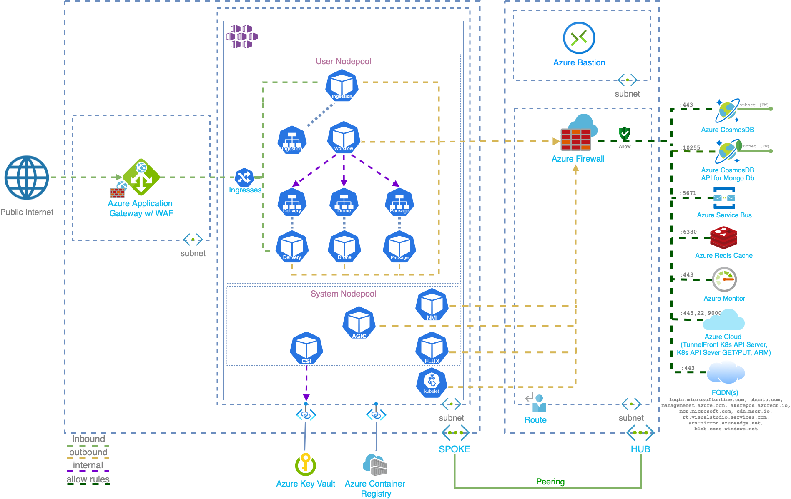

# Azure Kubernetes Service (AKS) Fabrikam Drone Delivery

This reference implementation shows a set of best practices for building and running a microservices architecture on Microsoft Azure. This content is built on top of the [AKS Secure Baseline](https://github.com/mspnp/aks-secure-baseline), which is the _recommended starting (baseline) infrastructure architecture_ for an [AKS cluster](https://azure.microsoft.com/services/kubernetes-service).

To quickly understand how the AKS Fabrikam Drone Delivery expands the AKS Secure Baseline, please refer to the following table:

|                                         | [AKS Secure Baseline](https://github.com/mspnp/aks-secure-baseline) | AKS Fabrikam Drone Delivery |
|-----------------------------------------|-------|----------|
| Egress restriction using Azure Firewall |  ✅   |    ✅    |
| Ingress Controller                      |  ✅   |    ✅    |
| Microsoft Entra Workload ID             |  ✅   |    ✅    |
| Resource Limits                         |  ✅   |    ✅    |
| Other Infrastructure aspects            |  ✅   |    ✅    |
| Zero Trust Network Policies             |  ❌   |    ✅    |
| Horizontal Pod Autoscaling              |  ❌   |    ✅    |
| Cluster Autoscaling                     |  ❌   |    ✅    |
| Readiness/Liveness Probes               |  ❌   |    ✅    |
| Helm charts                             |  ❌   |    ✅    |
| Distributed Monitoring                  |  ❌   |    ✅    |

**AKS Fabrikam Drone Delivery is not just workload focused**, but also incorporates the infrastructure journey by expanding the [AKS Secure Baseline](https://github.com/mspnp/aks-secure-baseline). Similar to what organizations might get into while trying to implement their solutions based on the AKS Secure Baseline, this reference implementation carefully modifies or interchanges small pieces like using a different kind of ingress controller or deploying a different workload on top of the cluster. If you or your team are on day 0 or looking for infrastructure-related aspects only, the recommendation is to start with the [AKS Secure Baseline](https://github.com/mspnp/aks-secure-baseline). If you want more comprehensive guidance for deploying a more *interesting* workload, this is the proper guidance to follow.

## Azure Architecture Center guidance

This project has a companion set of articles that describe challenges, design patterns, and best practices for a secure AKS cluster. You can find these articles on the Azure Architecture Center:

- [Designing, building, and operating microservices on Azure with Kubernetes](https://docs.microsoft.com/azure/architecture/microservices)
- [Microservices architecture on Azure Kubernetes Service (AKS)](https://docs.microsoft.com/azure/architecture/reference-architectures/microservices/aks)
- [Azure Kubernetes Service (AKS) Baseline Cluster](https://aka.ms/architecture/aks-baseline)

## Architecture

This architecture integrates with many Azure services to demonstrate workload with distributed tracing, messaging, and storage. This architecture also implements recommended native Kubernetes features such as auto-scaling capabilities, probes, network policies, and other standards like Helm charts and more. As a result of expanding the AKS Secure Baseline, this architecture should also be considered your starting point for pre-production and production stages.

An important distinction of this architecture is that it implements the [Azure Application Gateway Ingress Controller](https://docs.microsoft.com/azure/application-gateway/ingress-controller-overview) instead of using [Traefik](https://doc.traefik.io/traefik/v1.7/user-guide/kubernetes/) as in the baseline.

Throughout the reference implementation, you will see reference to _Fabrikam Drone Delivery Shipping App_. Fabrikam, Inc. (a fictional company) is starting a drone delivery service and has made the architectural decision of implementing its solution on top of the AKS Secure Baseline since it covers all the infrastructure aspects they are requested to operate. The company manages a fleet of drone aircraft. Businesses register with the service, and users can request a drone to pick up goods for delivery. When a customer schedules a pickup, a backend system assigns a drone and notifies the user with an estimated delivery time. While the delivery is in progress, the customer can track the drone's location with a continuously updated ETA.

### Core architecture components

#### Azure platform

* AKS v1.19
  * System and User [node pool separation](https://docs.microsoft.com/azure/aks/use-system-pools)
  * [AKS-managed Microsoft Entra ID](https://docs.microsoft.com/azure/aks/managed-aad)
  * Managed Identities
  * Azure CNI
  * [Azure Monitor for containers](https://docs.microsoft.com/azure/azure-monitor/insights/container-insights-overview)
* Azure Virtual Networks (hub-spoke)
* Azure Application Gateway (WAF)
* AKS-managed Internal Load Balancers
* Azure Firewall
* Azure Service Bus
* Azure CosmosDb
* Azure MongoDb
* Azure Redis Cache

#### In-cluster OSS components

* [Flux GitOps Operator](https://fluxcd.io)
* [Azure Application Gateway Ingress Controller](https://github.com/Azure/application-gateway-kubernetes-ingress)
* [Microsoft Entra Workload ID](https://github.com/Azure/aad-pod-identity)
* [Azure KeyVault Secret Store CSI Provider](https://github.com/Azure/secrets-store-csi-driver-provider-azure)
* [Kured](https://docs.microsoft.com/azure/aks/node-updates-kured)

## Deploy the reference implementation

Here are the required sections to follow for deploying the AKS Fabrikam Drone Delivery reference implementation.

* [ ] [Install and meet the prerequisites](./01-prerequisites.md)
* [ ] [Procure client-facing and AKS Ingress Controller TLS certificates](./02-ca-certificates.md)
* [ ] [Plan your Microsoft Entra integration](./03-auth.md)
* [ ] [Build the hub-spoke network](./04-networking.md)
* [ ] [Deploy the AKS cluster and supporting services](./05-aks-cluster.md)
* [ ] [Place the cluster under GitOps management](./06-gitops.md)
* [ ] [Workload prerequisites to address](./07-workload-prerequisites.md)
* [ ] [Configure AKS Ingress Controller with Azure Key Vault integration](./08-secret-managment-and-ingress-controller.md)
* [ ] [Deploy the workload](./09-workload.md)
* [ ] [Perform end-to-end deployment validation](./10-validation.md)
* [ ] [Cleanup all resources](./11-cleanup.md)

## Next Steps

This reference implementation intentionally does not cover all scenarios. If you are looking for other topics that are not addressed here, please visit [AKS Secure Baseline for the complete list of covered scenarios around AKS](https://github.com/mspnp/aks-secure-baseline#advanced-topics).

## Contributions

Please see our [contributor guide](./CONTRIBUTING.md).

This project has adopted the [Microsoft Open Source Code of Conduct](https://opensource.microsoft.com/codeofconduct/). For more information, see the [Code of Conduct FAQ](https://opensource.microsoft.com/codeofconduct/faq/) or contact <opencode@microsoft.com> with any additional questions or comments.

With :heart: from Microsoft Patterns & Practices, [Azure Architecture Center](https://aka.ms/architecture).
